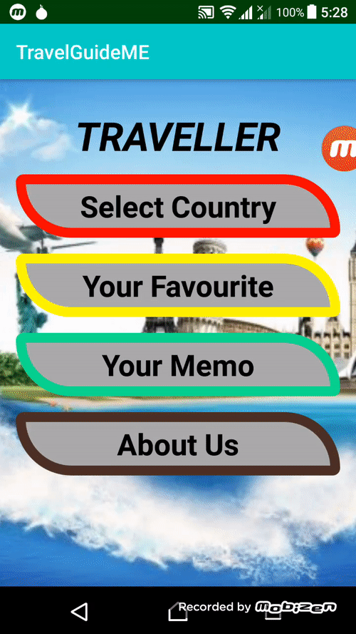

# TravelGuide
TravelGuide app by native android platform.

The mobile app that is specifically dedicated to travelers,
the app is built on the native platform so the speed is higher than others. In this app, 
I want to learn the native architecture and framework. How to data parse Uri, adapter concept and etc. 

So when we consider the app the app has few countries and their details, we can make favorite or not, 
keep a quick memo about the country,
look at the stored details and so on, the UI also designed according to UX laws so User Experience will be so high.



## Development setup
```
Gradle

Android 

SQLlite databse

```


Your Name – tharakakushan@gmail.com


## MIT License
```
Copyright (c) 2020 Kushan Tharaka

Permission is hereby granted, free of charge, to any person obtaining a copy
of this software and associated documentation files (the "Software"), to deal
in the Software without restriction, including without limitation the rights
to use, copy, modify, merge, publish, distribute, sublicense, and/or sell
copies of the Software, and to permit persons to whom the Software is
furnished to do so, subject to the following conditions:

The above copyright notice and this permission notice shall be included in all
copies or substantial portions of the Software.

THE SOFTWARE IS PROVIDED "AS IS", WITHOUT WARRANTY OF ANY KIND, EXPRESS OR
IMPLIED, INCLUDING BUT NOT LIMITED TO THE WARRANTIES OF MERCHANTABILITY,
FITNESS FOR A PARTICULAR PURPOSE AND NONINFRINGEMENT. IN NO EVENT SHALL THE
AUTHORS OR COPYRIGHT HOLDERS BE LIABLE FOR ANY CLAIM, DAMAGES OR OTHER
LIABILITY, WHETHER IN AN ACTION OF CONTRACT, TORT OR OTHERWISE, ARISING FROM,
OUT OF OR IN CONNECTION WITH THE SOFTWARE OR THE USE OR OTHER DEALINGS IN THE
SOFTWARE.
```
